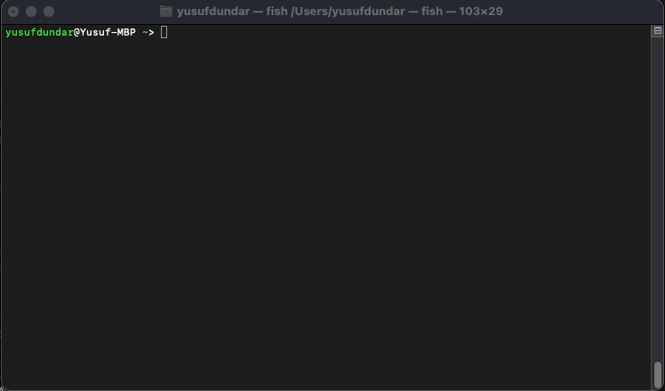

[](https://github.com/yusufdundar/formulago/actions/workflows/go.yml)
[](https://github.com/yusufdundar/formulago/actions/workflows/golangci-lint.yml)

---

## 🏎  About The Project

Formula 1 race statistics for CLI written with GO.\
Basicly It scrapes [Formula 1](https://formula1.com) website to get information about standings and race result.



### ⚙️ Installation

1. Need GO installed. Refer to [GO Website](https://go.dev/dl/)

2. Install with GO

   ```sh
   go install github.com/yusufdundar/formulago@latest
   ```

> **Warning**
> In order to run `formulago` from anywhere in terminal `$GOPATH/bin` environment value must be in the PATH.

## 🏁 Usage

For now FormulaGo have one command.

   ```sh
   formulago result
   ```

There are 3 different flags you can use with the `result` command.

* `--driver` or `-d` shows driver standings
* `--constructor` or `-c` shows constructor standings
* `--race` or `-r` shows race results


## 📖 Libraries

This project uses following go libraries:

* [cobra](https://github.com/spf13/cobra)
* [goquery](https://github.com/PuerkitoBio/goquery)
* [tablewriter](https://github.com/olekukonko/tablewriter)

## ⚠️ License

Distributed under the MIT License. See [`LICENSE`](./LICENSE) for more information.

<p align="right">(<a href="#top">back to top</a>)</p>
